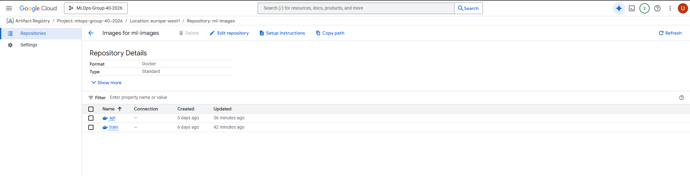
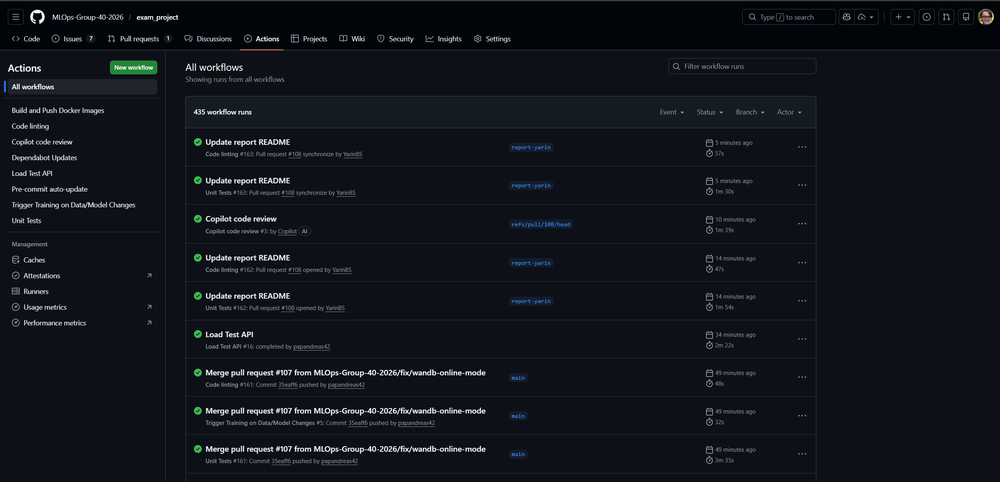
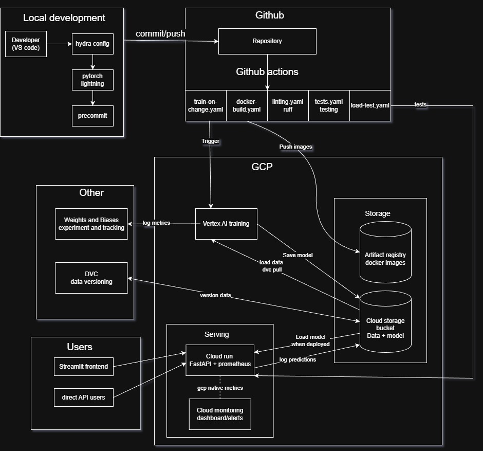

# Exam template for 02476 Machine Learning Operations

This is the report template for the exam. Please only remove the text formatted as with three dashes in front and behind
like:

```--- question 1 fill here ---```

Where you instead should add your answers. Any other changes may have unwanted consequences when your report is
auto-generated at the end of the course. For questions where you are asked to include images, start by adding the image
to the `figures` subfolder (please only use `.png`, `.jpg` or `.jpeg`) and then add the following code in your answer:

``

In addition to this markdown file, we also provide the `report.py` script that provides two utility functions:

Running:

```bash
python report.py html
```

Will generate a `.html` page of your report. After the deadline for answering this template, we will auto-scrape
everything in this `reports` folder and then use this utility to generate a `.html` page that will be your serve
as your final hand-in.

Running

```bash
python report.py check
```

Will check your answers in this template against the constraints listed for each question e.g. is your answer too
short, too long, or have you included an image when asked. For both functions to work you mustn't rename anything.
The script has two dependencies that can be installed with

```bash
pip install typer markdown
```

or

```bash
uv add typer markdown
```

## Overall project checklist

The checklist is *exhaustive* which means that it includes everything that you could do on the project included in the
curriculum in this course. Therefore, we do not expect at all that you have checked all boxes at the end of the project.
The parenthesis at the end indicates what module the bullet point is related to. Please be honest in your answers, we
will check the repositories and the code to verify your answers.

### Week 1

* [X] Create a git repository (M5)
* [X] Make sure that all team members have write access to the GitHub repository (M5)
* [X] Create a dedicated environment for you project to keep track of your packages (M2)
* [X] Create the initial file structure using cookiecutter with an appropriate template (M6)
* [X] Fill out the `data.py` file such that it downloads whatever data you need and preprocesses it (if necessary) (M6)
* [X] Add a model to `model.py` and a training procedure to `train.py` and get that running (M6)
* [X] Remember to fill out the `requirements.txt` and `requirements_dev.txt` file with whatever dependencies that you
    are using (M2+M6)
* [X] Remember to comply with good coding practices (`pep8`) while doing the project (M7)
* [X] Do a bit of code typing and remember to document essential parts of your code (M7)
* [X] Setup version control for your data or part of your data (M8)
* [X] Add command line interfaces and project commands to your code where it makes sense (M9)
* [X] Construct one or multiple docker files for your code (M10)
* [X] Build the docker files locally and make sure they work as intended (M10)
* [X] Write one or multiple configurations files for your experiments (M11)
* [X] Used Hydra to load the configurations and manage your hyperparameters (M11)
* [?] Use profiling to optimize your code (M12)
* [X] Use logging to log important events in your code (M14)
* [X] Use Weights & Biases to log training progress and other important metrics/artifacts in your code (M14)
* [X] Consider running a hyperparameter optimization sweep (M14)
* [X] Use PyTorch-lightning (if applicable) to reduce the amount of boilerplate in your code (M15)

### Week 2

* [X] Write unit tests related to the data part of your code (M16)
* [X] Write unit tests related to model construction and or model training (M16)
* [X] Calculate the code coverage (M16)
* [X] Get some continuous integration running on the GitHub repository (M17)
* [X] Add caching and multi-os/python/pytorch testing to your continuous integration (M17)
* [X] Add a linting step to your continuous integration (M17)
* [X] Add pre-commit hooks to your version control setup (M18)
* [X] Add a continues workflow that triggers when data changes (M19)
* [X] Add a continues workflow that triggers when changes to the model registry is made (M19)
* [X] Create a data storage in GCP Bucket for your data and link this with your data version control setup (M21)
* [X] Create a trigger workflow for automatically building your docker images (M21)
* [X] Get your model training in GCP using either the Engine or Vertex AI (M21)
* [X] Create a FastAPI application that can do inference using your model (M22)
* [X] Deploy your model in GCP using either Functions or Run as the backend (M23)
* [X] Write API tests for your application and setup continues integration for these (M24)
* [X] Load test your application (M24)
* [ ] Create a more specialized ML-deployment API using either ONNX or BentoML, or both (M25)
* [X] Create a frontend for your API (M26)

### Week 3

* [X] Check how robust your model is towards data drifting (M27)
* [ ] Deploy to the cloud a drift detection API (M27)
* [X] Instrument your API with a couple of system metrics (M28)
* [X] Setup cloud monitoring of your instrumented application (M28)
* [X] Create one or more alert systems in GCP to alert you if your app is not behaving correctly (M28)
* [X] If applicable, optimize the performance of your data loading using distributed data loading (M29)
* [ ] If applicable, optimize the performance of your training pipeline by using distributed training (M30)
* [ ] Play around with quantization, compilation and pruning for you trained models to increase inference speed (M31)

### Extra

* [X] Write some documentation for your application (M32)
* [soon] Publish the documentation to GitHub Pages (M32)
* [?] Revisit your initial project description. Did the project turn out as you wanted?
* [soon] Create an architectural diagram over your MLOps pipeline
* [?] Make sure all group members have an understanding about all parts of the project
* [X] Uploaded all your code to GitHub

## Group information

### Question 1
> **Enter the group number you signed up on <learn.inside.dtu.dk>**
>
> Answer:

40

### Question 2
> **Enter the study number for each member in the group**
>
> Example:
>
> *sXXXXXX, sXXXXXX, sXXXXXX*
>
> Answer:

s256475, s232477, s256672, s260189

### Question 3
> **A requirement to the project is that you include a third-party package not covered in the course. What framework**
> **did you choose to work with and did it help you complete the project?**
>
> Recommended answer length: 100-200 words.
>
> Example:
> *We used the third-party framework ... in our project. We used functionality ... and functionality ... from the*
> *package to do ... and ... in our project*.
>
> Answer:

frameworks

## Coding environment

> In the following section we are interested in learning more about you local development environment. This includes
> how you managed dependencies, the structure of your code and how you managed code quality.

### Question 4

> **Explain how you managed dependencies in your project? Explain the process a new team member would have to go**
> **through to get an exact copy of your environment.**
>
> Recommended answer length: 100-200 words
>
> Example:
> *We used ... for managing our dependencies. The list of dependencies was auto-generated using ... . To get a*
> *complete copy of our development environment, one would have to run the following commands*
>
> Answer:

We used the uv package manager for managing our dependencies. The list of dependencies was initialized by cookiecutter and extended throughout the course by adding the packages required to fulfill the checklist. Dependences were defined and locked using pyproject.toml and uv.lock. That allows any user to recreate the exact environment via uv sync. Additionally, docker was used to package the same locked environment, ensuring identical code behaviour on different machines and in GPC.

### Question 5

> **We expect that you initialized your project using the cookiecutter template. Explain the overall structure of your**
> **code. What did you fill out? Did you deviate from the template in some way?**
>
> Recommended answer length: 100-200 words
>
> Example:
> *From the cookiecutter template we have filled out the ... , ... and ... folder. We have removed the ... folder*
> *because we did not use any ... in our project. We have added an ... folder that contains ... for running our*
> *experiments.*
>
> Answer:

We initialized our project using the MLOps cookiecutter template, as provided in M6 on code structure. The main source code lives in `src/coffee_leaf_classifier/` where we filled out `data.py`, `model.py`, `train.py` , `api.py`, and `app.py`. The `tests/` folder contains unit tests for data, model, and API components.

I don't remember how cookiecutter is by default or if we added  anything this needs to be chekced. Yarin might help here.

### Question 6

> **Did you implement any rules for code quality and format? What about typing and documentation? Additionally,**
> **explain with your own words why these concepts matters in larger projects.**
>
> Recommended answer length: 100-200 words.
>
> Example:
> *We used ... for linting and ... for formatting. We also used ... for typing and ... for documentation. These*
> *concepts are important in larger projects because ... . For example, typing ...*
>
> Answer:

We used `ruff` for both linting and formatting our code, configured with a line length of 120 characters. `ruff` is integrated into our CI pipeline and runs on every pull request. We also set up `pre-commit` hooks that automatically run `ruff` (with auto-fix) and checks for proper formatting and large files before each commit.

For typing we use python type..... Documentation follows google style docstrings and we generate API documentation using mkdocs with the mkdocstrings plugin.

Compliance with these concepts in larger projects helps to ensure consistency across multiple contributors, avoiding extensive code differences and a messy resulting code environment. Aditionally, following code rules allows ealry bug catching, e.g. early recognition of typo errors or undefined variables. In general, it creates a codebase that is easier to understand and maintain. Automated formatting also eliminates pointless style debates in code reviews, allowing the workflow to focus on the code content.

## Version control

> In the following section we are interested in how version control was used in your project during development to
> corporate and increase the quality of your code.

### Question 7

> **How many tests did you implement and what are they testing in your code?**
>
> Recommended answer length: 50-100 words.
>
> Example:
> *In total we have implemented X tests. Primarily we are testing ... and ... as these the most critical parts of our*
> *application but also ... .*
>
> Answer:

In total, we have implemented 21 tests across three test files. We test the API endpoints (`/health`, `/info`, `/predict`) to ensure the inference service works correctly and handles errors gracefully (invalid input, missing files). We test the data loading pipeline to verify dataset structure, image preprocessing, and correct tensor shapes. We also test the model's forward pass to ensure correct output dimensions and that prediction probabilities sum to 1.

### Question 8

> **What is the total code coverage (in percentage) of your code? If your code had a code coverage of 100% (or close**
> **to), would you still trust it to be error free? Explain you reasoning.**
>
> Recommended answer length: 100-200 words.
>
> Example:
> *The total code coverage of code is X%, which includes all our source code. We are far from 100% coverage of our **
> *code and even if we were then...*
>
> Answer:

The total code coverage of our code is 76% which includes the main source modules: `api.py` (81%), `data.py` (95%), and `model.py` (55%). We are not at 100% coverage and even if we were we would not fully trust it to be error free as code coverage only measures which lines of code are executed during tests amd not whether the tests actually verify correct behavior. A test could execute all lines without checking any assertions. Also coverage does not account for edge cases, race conditions, or integration issues between components. For example, our model tests verify the forward pass works, but don't test all possible input combinations or error conditions. Bugs might occur at borders of systems (API/model, model/data) or under specific conditions not covered by unit tests. As such, while high coverage is useful as a metric, there should also be integration tests, manual testing and monitoring in production.

### Question 9

> **Did you workflow include using branches and pull requests? If yes, explain how. If not, explain how branches and**
> **pull request can help improve version control.**
>
> Recommended answer length: 100-200 words.
>
> Example:
> *We made use of both branches and PRs in our project. In our group, each member had an branch that they worked on in*
> *addition to the main branch. To merge code we ...*
>
> Answer:

We made extensive use of branches and pull requests in our project. Each new feature or bug fix was developed on a dedicated branch. We created over 100 pull requests throughout the project with each PR requiring review before merging to main.

Our workflow was to create a branch from main, implement the feature, push and open a PR, wait for CI checks (tests, linting etc.) to pass, then get a code review from at least one team member and finally merge. This prevented broken code from reaching the main branch and enabled parallel development. Github's interface for PRs made easy to discuss changes, suggest improvements and track what each team member was working on. We also used PR descriptions to document what changed and why, documenting the history of the project's progression.

### Question 10

> **Did you use DVC for managing data in your project? If yes, then how did it improve your project to have version**
> **control of your data. If no, explain a case where it would be beneficial to have version control of your data.**
>
> Recommended answer length: 100-200 words.
>
> Example:
> *We did make use of DVC in the following way: ... . In the end it helped us in ... for controlling ... part of our*
> *pipeline*
>
> Answer:

We used DVC for managing both our dataset and trained model checkpoints. The coffee leaf disease dataset is stored in GCS bucket (`gs://mlops-group-40-2026-dvc/`) with DVC tracking files (`data/coffee_leaf_diseases.dvc`) committed to git. This allows team members to pull the exact same data version with dvc pull.

DVC improved our project by keeping large binary files out of git while maintaining version control. If we update the dataset or retrain a model we would only need to `dvc add` the new files and commit the updated `.dvc` files. This creates a clear history of data versions linked to code versions. Our training docker container runs `dvc pull` at runtime to fetch the correct data version and the data loading code has a fallback if DVC data is not available locally. Then, it just downloads directly from HuggingFace. This made our pipeline work both in cloud training (Vertex AI with DVC) and local development.

### Question 11

> **Discuss you continuous integration setup. What kind of continuous integration are you running (unittesting,**
> **linting, etc.)? Do you test multiple operating systems, Python  version etc. Do you make use of caching? Feel free**
> **to insert a link to one of your GitHub actions workflow.**
>
> Recommended answer length: 200-300 words.
>
> Example:
> *We have organized our continuous integration into 3 separate files: one for doing ..., one for running ... testing*
> *and one for running ... . In particular for our ..., we used ... .An example of a triggered workflow can be seen*
> *here: <weblink>*
>
> Answer:

We organized our continuous integration into 6 github action workflows.

1. **tests.yaml**: Runs our pytest unit tests on every push and PR. Uses `uv` for fast dependency installation with caching enabled.

2. **linting.yaml**: Runs ruff linter and formatter checks to enforce code style consistency. This catches style issues before they are merged to main.

3. **docker-build.yaml**: Builds and pushes docker images to artifact registry on pushes to main. Builds both training and api images.

4. **train-on-change.yaml**: We trigger vertex AI training when data files, model files, or config files change.

5. **load-test.yaml**: Runs Locust load tests against our deployed API after docker builds complete, triggered via `workflow_run`.

6. **pre-commit-update.yaml**: Updates pre commit hooks weekly to keep dependencies current.

We use caching for `uv` dependencies to speed up CI runs cached runs complete in under 2 minutes versus 5+ minutes uncached. We test across multiple operating systems (Ubuntu, Windows, macOS) and Python versions (3.11, 3.12) using a matrix strategy so we make sure code works across different environments. The workflows ensured we could have confidence in our code during development as we could catch code that led to failing tests and lateron also failing training or docker image building. An example of our test workflow can be seen here https://github.com/MLOps-Group-40-2026/exam_project/actions/workflows/tests.yaml


## Running code and tracking experiments

> In the following section we are interested in learning more about the experimental setup for running your code and
> especially the reproducibility of your experiments.

### Question 12

> **How did you configure experiments? Did you make use of config files? Explain with coding examples of how you would**
> **run a experiment.**
>
> Recommended answer length: 50-100 words.
>
> Example:
> *We used a simple argparser, that worked in the following way: Python  my_script.py --lr 1e-3 --batch_size 25*
>
> Answer:

For the project, we configured our work using Hydra, which allows the creation of hierarchical and composable configuration files written in YAML. Thus, we separated configuration into three different groups (experiment, model, training), making it easy to define different setups without changing code. Additiopally, Hydra allows overriding parameters from the command line, enabling rapid experimentation unbounded from the initial configuration. Experiments were executed using uv run, ensuring they always run inside the exact same virtual environment, using either our original configurration or overridden parameters.

To run locally:
```bash
PYTHONPATH=src uv run python -m coffee_leaf_classifier.train \
  training.epochs=1 \
  training.num_workers=0
```

### Question 13

> **Reproducibility of experiments are important. Related to the last question, how did you secure that no information**
> **is lost when running experiments and that your experiments are reproducible?**
>
> Recommended answer length: 100-200 words.
>
> Example:
> *We made use of config files. Whenever an experiment is run the following happens: ... . To reproduce an experiment*
> *one would have to do ...*
>
> Answer:

For experiment reproducibility, we inserted random seeds and ensured that all experiment parameters were captured through hydra configurations. In addition, we used W&B to automatically log configuration values, metrics, and runtime metadata for every experiment,guaranteeing that all the information about the different runs are documented. Therefore, each experiment can be reproduced by combining the recorded configuration with the corresponding code version.

### Question 14

> **Upload 1 to 3 screenshots that show the experiments that you have done in W&B (or another experiment tracking**
> **service of your choice). This may include loss graphs, logged images, hyperparameter sweeps etc. You can take**
> **inspiration from [this figure](figures/wandb.png). Explain what metrics you are tracking and why they are**
> **important.**
>
> Recommended answer length: 200-300 words + 1 to 3 screenshots.
>
> Example:
> *As seen in the first image when have tracked ... and ... which both inform us about ... in our experiments.*
> *As seen in the second image we are also tracking ... and ...*
>
> Answer:

W&B here

### Question 15

> **Docker is an important tool for creating containerized applications. Explain how you used docker in your**
> **experiments/project? Include how you would run your docker images and include a link to one of your docker files.**
>
> Recommended answer length: 100-200 words.
>
> Example:
> *For our project we developed several images: one for training, inference and deployment. For example to run the*
> *training docker image: `docker run trainer:latest lr=1e-3 batch_size=64`. Link to docker file: <weblink>*
>
> Answer:

We made two docker images for our project, one for training and one for API deployment.

The training one contains all dependencies needed to train the model, including PyTorch, DVC, and W&B. It runs `dvc pull` at container startup to fetch data from GCS then executes the training script. This image is used by vertex AI for cloud training.

The API one contains FastAPI, the model loading code, and prometheus instrumentation. At startup it downloads the trained model from GCS and serves predictions.

To run locally:
```bash
docker build -f dockerfiles/api.dockerfile -t coffee-api .
docker run -p 8000:8000 coffee-api
```

Images are automatically built and pushed to artifact registry via github actions on every push to main.

### Question 16

> **When running into bugs while trying to run your experiments, how did you perform debugging? Additionally, did you**
> **try to profile your code or do you think it is already perfect?**
>
> Recommended answer length: 100-200 words.
>
> Example:
> *Debugging method was dependent on group member. Some just used ... and others used ... . We did a single profiling*
> *run of our main code at some point that showed ...*
>
> Answer:

Debugging methods varied by team member. Some used IDEs debugger with breakpoints while others relied on print statements or logging. As most issues where related to cloud debugging (Vertex AI or cloud run) we heavily used GCPs cloud logging to view container logs and identify issues.

We did not profile our code yet (pawans PR should have this) this needs to be expanded upon.


## Working in the cloud

> In the following section we would like to know more about your experience when developing in the cloud.

### Question 17

> **List all the GCP services that you made use of in your project and shortly explain what each service does?**
>
> Recommended answer length: 50-200 words.
>
> Example:
> *We used the following two services: Engine and Bucket. Engine is used for... and Bucket is used for...*
>
> Answer:

We used the following GCP services:

- **Cloud Storage (GCS)**: Stores our DVC-tracked dataset, trained model checkpoints and prediction logs.
- **Artifact Registry**: Stores our two docker images with versioning.
- **Vertex AI**: Runs our training jobs on  VMs. We submit custom training jobs that pull our training docker image.
- **Cloud Run**: Hosts our FastAPI inference API. Scales based on traffic and provides HTTPS endpoints.
- **Cloud Monitoring**: Collects and displays metrics from our API (request latency, count, errors). We also created a custom dashboard.
- **Cloud Alerting**: Sends notifications when metrics exceed thresholds (e.g., high error rate, instance scaling).
- **IAM & Workload Identety Federation**: Enables secure, keyless authentication from github actions to GCP services.

### Question 18

> **The backbone of GCP is the Compute engine. Explained how you made use of this service and what type of VMs**
> **you used?**
>
> Recommended answer length: 100-200 words.
>
> Example:
> *We used the compute engine to run our ... . We used instances with the following hardware: ... and we started the*
> *using a custom container: ...*
>
> Answer:

We primarily used vertex AI rather than compute engine VMs as Vertex AI manages it automatically. When submitting training jobs to Vertex AI we specified `n1-standard-4` machine types, which have NVIDIA T4 GPUs to accelerate training.

Vertex AI custom training jobs work by pulling our training docker image from artifact registry spinning up VN with sepcified hardware and shutting down the VM when training completes. This is more cost effective than keeping a VM running continuously this also avoids the hassle of remembering to close it down and running everything manually.

For cloud run we let GCP auto-scale instances based on incoming request load. The API container uses minimal resources (1 vCPU, 512MB RAM) since inference is lightweight after the model is loaded.

### Question 19

> **Insert 1-2 images of your GCP bucket, such that we can see what data you have stored in it.**
> **You can take inspiration from [this figure](figures/bucket.png).**
>
> Answer:


Our GCS bucket `mlops-group-40-2026-dvc` contains:
- `data/`: DVC-tracked coffee leaf disease dataset
- `models/`: Trained model checkpoints
- `predictions/`: Logged predictions from the API for drift monitoring

### Question 20

> **Upload 1-2 images of your GCP artifact registry, such that we can see the different docker images that you have**
> **stored. You can take inspiration from [this figure](figures/registry.png).**
>
> Answer:



Our Artifact Registry repository `ml-images` in `europe-west1` contains two Docker images
- `train`: Training container with PyTorch, DVC, and training scripts
- `api`: FastAPI inference container with model serving code

Each image has multiple tagged versions corresponding to git commits allowing us to roll back if needed.

### Question 21

> **Upload 1-2 images of your GCP cloud build history, so we can see the history of the images that have been build in**
> **your project. You can take inspiration from [this figure](figures/build.png).**
>
> Answer:



The image shows our action workflow history with green checkmarks indicating successful builds. Each build pushes both training and API images to Artifact Registry. Failed builds (red X) helped us identify and fix issues.

### Question 22

> **Did you manage to train your model in the cloud using either the Engine or Vertex AI? If yes, explain how you did**
> **it. If not, describe why.**
>
> Recommended answer length: 100-200 words.
>
> Example:
> *We managed to train our model in the cloud using the Engine. We did this by ... . The reason we choose the Engine*
> *was because ...*
>
> Answer:

We successfully trained our model in the cloud using Vertex AI. We chose Vertex AI over raw Compute Engine because it handles VM and cleanup with no hassle. Gihub actions builds and pushes the training docker image to artifact registry andthe a CI workflow (see train-on-change.yaml) triggers when data or config files change, which auot submits a Vertex AI custom training job using a gcloud command- Vertex AI pulls the Docker image and runs training on a GPU VM amd the trained model is saved to GCS.

The training config (`vertex_train.yaml`) specifies the machine type (`n1-standard-4`), GPU (NVIDIA T4), and Docker image URI. Training runs take about 15-20 minutes for our dataset. We can also manually trigger training jobs from the command line for experimentation.

## Deployment

### Question 23

> **Did you manage to write an API for your model? If yes, explain how you did it and if you did anything special. If**
> **not, explain how you would do it.**
>
> Recommended answer length: 100-200 words.
>
> Example:
> *We did manage to write an API for our model. We used FastAPI to do this. We did this by ... . We also added ...*
> *to the API to make it more ...*
>
> Answer:

We wrote a FastAPI application for model inference (src/coffee_leaf_classifier/api.py). The API has three main endpoints

- `GET /health`: Returns service health status
- `GET /info`: Returns model metadata (classes, version)
- `POST /predict`: Accepts an image file and returns disease classification with probabilities

We added prometheus metrics instrumentation for monitoring (request latency, count, errors), structured logging with loguru. The model is loaded from GCS at startup and cached in memory for fast inference. We also built a streamlit frontend (app.py) that communicates with the API. Input validation ensures only valid image files (jpg, png) are accepted, returning appropriate HTTP 400 errors for invalid requests.

### Question 24

> **Did you manage to deploy your API, either in locally or cloud? If not, describe why. If yes, describe how and**
> **preferably how you invoke your deployed service?**
>
> Recommended answer length: 100-200 words.
>
> Example:
> *For deployment we wrapped our model into application using ... . We first tried locally serving the model, which*
> *worked. Afterwards we deployed it in the cloud, using ... . To invoke the service an user would call*
> *`curl -X POST -F "file=@file.json"<weburl>`*
>
> Answer:

We deployed our API both locally and to the cloud. For local development and testing we run the FastAPI server with hot-reloading:
```bash
uv run uvicorn src.coffee_leaf_classifier.api:app --reload
```

For cloud deployment we use cloud run. Our API Docker image is built by github actions and pushed to artifact registry. Then we manually deploy to cloud run. The API is publicly accessible at: `https://coffee-api-485178670977.europe-west1.run.app`

To invoke the prediction service users can send an image file via curl:
```bash
curl -X POST -F "file=@coffee_leaf.jpg" https://coffee-api-485178670977.europe-west1.run.app/predict
```

The response contains the predicted disease class and confidence probabilities for all classes. Cloud run auto scales from 0 to more instances based on incoming traffic. When idle it scales to zero to minimize costs.

### Question 25

> **Did you perform any unit testing and load testing of your API? If yes, explain how you did it and what results for**
> **the load testing did you get. If not, explain how you would do it.**
>
> Recommended answer length: 100-200 words.
>
> Example:
> *For unit testing we used ... and for load testing we used ... . The results of the load testing showed that ...*
> *before the service crashed.*
>
> Answer:

We performed both unit testing and load testing of our API.

For **unit testing**, we use pytest with 12 tests covering the API endpoints. Tests verify correct responses for valid inputs, proper error handling for invalid files, and health check functionality. These run automatically in CI on every PR.

For **load testing**, we used Locust. Our load test simulates users uploading images to the `/predict` endpoint. Results showed:
- The API handles ~20-30 requests/second on a single cloud run instance
- Average response time: ~200-300ms per prediction
- Cloud run auto scaled to multiple instances under heavy load
- No failures under sustained load of 50 concurrent users

The load test runs automatically in github actions after docker builds complete, ensuring we catch performance regressions.

### Question 26

> **Did you manage to implement monitoring of your deployed model? If yes, explain how it works. If not, explain how**
> **monitoring would help the longevity of your application.**
>
> Recommended answer length: 100-200 words.
>
> Example:
> *We did not manage to implement monitoring. We would like to have monitoring implemented such that over time we could*
> *measure ... and ... that would inform us about this ... behaviour of our application.*
>
> Answer:

Yes, we implemented comprehensive monitoring for our deployed API:

1. **Prometheus Instrumentation**: Using promethues our API automatically exposes metrics at `/metrics` including request latency histograms, request counts by endpoint and status code, and active request gauges.

2. **GCP Cloud Monitoring**: We created a custom dashboard showing API request rates, latency percentiles (p50, p95, p99), error rates, and cloud run instance counts for API health.

3. **Alerting**: We configured GCP alerts that notify us via email when error rates spike, latency exceeds thresholds or when service is down.

4. **Prediction Logging**: Each prediction is logged to GCS with the input image, predicted class, confidence score, and timestamp. This enables drift detection by comparing prediction distributions over time.

This monitoring helps us to ensure the API is healthy in a production scenario and allows for detection of issues before users are significantly impacted.

## Overall discussion of project

> In the following section we would like you to think about the general structure of your project.

### Question 27

> **How many credits did you end up using during the project and what service was most expensive? In general what do**
> **you think about working in the cloud?**
>
> Recommended answer length: 100-200 words.
>
> Example:
> *Group member 1 used ..., Group member 2 used ..., in total ... credits was spend during development. The service*
> *costing the most was ... due to ... . Working in the cloud was ...*
>
> Answer:

We estimate our group used approximately $(check number) in GCP credits across all members. Services were:

1. **Vertex AI training**: Each GPU training job costs ~$...., and we ran many iterations during development and debugging.
2. **Cloud Run**: Minimal cost due to scaling to zero and load testing was quite limited so low spikes.
3. **Cloud Storage**: Negligible cost for our ~500MB dataset.

Working in the cloud was initially challenging due to the learning curve with permissions, service accounts, and the many interconnected GCP services. Setting up CI/CD integration with github actions  took some trial and error. Once configured the cloud infrastructure proved very good for efficiency as we could run GPU training without local hardware, deploy APIs with automatic scaling and collaborate with the shared cloud resources. In retrospect we should have begun automating a lot of the cloud stuff with CI/CD and actions earlier as we spent quite some time on gcloud commands.

### Question 28

> **Did you implement anything extra in your project that is not covered by other questions? Maybe you implemented**
> **a frontend for your API, use extra version control features, a drift detection service, a kubernetes cluster etc.**
> **If yes, explain what you did and why.**
>
> Recommended answer length: 0-200 words.
>
> Example:
> *We implemented a frontend for our API. We did this because we wanted to show the user ... . The frontend was*
> *implemented using ...*
>
> Answer:

We implemented several extra features:

1. **Streamlit Frontend** A very simple web UI (`app.py`) where users can upload coffee leaf images and see predictions with confidence scores visualized as bar charts.

2. **Data Drift Detection**: Using evidently, we created a drift detection script (`drift_detection.py`) that compares incoming prediction data distributions against the training data baseline. This helps identify when the model may need retraining.

3. **Prediction Logging**: Every API prediction is logged to GCS with metadata (timestamp, predicted class, confidence). This creates an audit trail and enables offline drift analysis.

4. **Automated Training Triggers**: CI/CD workflow that automatically submits Vertex AI training jobs when data or config files change.

### Question 29

> **Include a figure that describes the overall architecture of your system and what services that you make use of.**
> **You can take inspiration from [this figure](figures/overview.png). Additionally, in your own words, explain the**
> **overall steps in figure.**
>
> Recommended answer length: 200-400 words
>
> Example:
>
> *The starting point of the diagram is our local setup, where we integrated ... and ... and ... into our code.*
> *Whenever we commit code and push to GitHub, it auto triggers ... and ... . From there the diagram shows ...*
>
> Answer:



Our MLOps pipeline consists of three main flows development, training, and serving.

**Development Flow**
Developers work locally using VS Code with Python, PyTorch Lightning, and Hydra for configuration. Code is version controlled with git and data is version controlled with DVC pointing to a GCS bucket. Precommit hooks run ruff for linting/formatting before each commit to ensure code stays consistent.

**CI/CD Flow**
When code is pushed to GitHub, several workflows trigger automatically:
1. **tests.yaml**: Runs pytest unit tests
2. **linting.yaml**: Checks code style with ruff
3. **docker-build.yaml**: Builds Docker images and pushes to artifact registry
4. **train-on-change.yaml**: If data or config files changed, submits a Vertex AI training job

**Training Flow**
Vertex AI pulls the training Docker image from Artifact Registry, provisions a GPU VM, runs training, logs metrics to Weights & Biases, and saves the model checkpoint to GCS. DVC tracks the model version.

**Serving Flow**
Cloud run hosts our FastAPI inference API. At startup it downloads the latest model from GCS. Users (or the Streamlit frontend) send images to the `/predict` endpoint. The API returns predictions and logs them to GCS for drift monitoring. Prometheus metrics are scraped by cloud monitoring, which powers our dashboard and alerting.

This architecture enables reproducible experiments, automated training, and scalable serving with minimal manual intervention. Several features we wanted to add but could not due to time constraints.
Ideally we would have orchestrated the flow so that we restart the cloud run FastAPI when a new model is added to GCS, then we would run the load test on the new model and run drift detection, which then ends quielty if no drift is detected or does some sort of alert of triggers a retrain if drift is detected.

### Question 30

> **Discuss the overall struggles of the project. Where did you spend most time and what did you do to overcome these**
> **challenges?**
>
> Recommended answer length: 200-400 words.
>
> Example:
> *The biggest challenges in the project was using ... tool to do ... . The reason for this was ...*
>
> Answer:

The biggest challenges in our project were:

**1. DVC in docker containers**: Getting DVC to work inside Docker containers was frustrating. The `dvc pull` command requires git context by default, but Docker containers don't have the full git repository. We initially tried `--no-scm` flags that didn't exist, then discovered we needed to set `no_scm = true` in `.dvc/config`. This took multiple PRs to resolve.

**2. github actions disk space**: Our Docker builds started failing with "no space left" errors. Github actions runners have limited disk space and our images are large. We solved this by adding cleanup steps that remove unused software before building.

**3. GCP**: Many operations failed silently or with hard to read errors due to missing IAM roles. Setting up WIF required configuration of service account permissions, workload identity pools and attribute mappings. Debugging any cloud related infrastructure issues in the pipeline was more challenging than anticipated and took a long time as docker images had to rebuilt and pushed and jobs had to be restarted.

**4. Coordinating as a Team**: With multiple team members working on different features simultaneously we sometimes had merge conflicts or stepped on each other's changes. We improved by communicating more actively about who was working on what and using smaller more focused PRs. It was also a challenge keeping track of everything that was being worked what could be checked and what to work on next.
We managed using github issues as a project planner, where we tried to keep an overview of stuff to work on and its priority.

In general debugging infrastructure rather than code and the boundaries between the different steps in pipeline was really challenging and not something we had worked on before.

### Question 31

> **State the individual contributions of each team member. This is required information from DTU, because we need to**
> **make sure all members contributed actively to the project. Additionally, state if/how you have used generative AI**
> **tools in your project.**
>
> Recommended answer length: 50-300 words.
>
> Example:
> *Student sXXXXXX was in charge of developing of setting up the initial cookie cutter project and developing of the*
> *docker containers for training our applications.*
> *Student sXXXXXX was in charge of training our models in the cloud and deploying them afterwards.*
> *All members contributed to code by...*
> *We have used ChatGPT to help debug our code. Additionally, we used GitHub Copilot to help write some of our code.*
> Answer:

**Student s256475 (Ulrik)**: Led infrastructure and MLOps pipeline development including streamlit frontend, cloud run API deployment, load testing with Locust, GCP Artifact Registry integration, DVC data versioning, github actions and general CI/CD workflows, Vertex AI cloud training, drift detection with evidently and prediction logging. Debugged containerized deployments and wrote documentation for relevant sections.

**Student s260189 (Lampros)**: Primary code reviewer and repository maintainer main reponsible for code reviews and approving pull requests. Implemented distributed data loading, hydra configuration templates, dataset unit tests, W&B logging integration, and setup the GCP alerts.

**Student s256672 (Yarin)**: Initialized the cookiecutter project template and implemented the model architecture. Created the hyperparameter sweep configuration (W&B sweeps) and contributed model unit tests. Contributed to project planning and discussions. Generative AI tools were mainly used for debugging assistance alongside the IDE, and overall brainstorming.

**Student s232477 (Andreas)**: Initialized the group's Github organization and repository to ensure all members have admin access. Set up Prometheus API instrumentation for monitoring. Responsible for data and model development, DVC setup, and code reviews.

**Student sXXXXXX (Pawan)**: Contributed to project planning and discussions.

All members participated through our PR based workflow. We used github copilot to debug infrastructure issues (GCP IAM, docker, github actions) and to generate boilerplate code, which significantly accelerated development.

Generative AI tools were used for mainly explanatory purposes and late code review and refining.